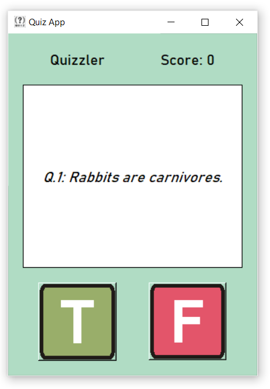

# ❓ Quiz App – A Fun True/False Trivia Game in Python

**Quiz App** is a simple, interactive quiz game built using Python and Tkinter.  
It fetches random True/False questions from the Trivia API and challenges users to score as high as they can.  
Perfect for casual fun, practice, or learning new trivia!

---

**The Mission:**  
To make learning fun and engaging through a quick, user-friendly interface.  
This app helps improve your knowledge in an enjoyable way using real-time quiz data.

---

## 💻 Download for Windows

🔗 [Download Now!](https://github.com/yourusername/quiz-app/releases/download/v1.0.0/QuizAppSetup.exe)

---

## 🚀 Features

🎯 **10 Random Questions** – Every time you start, the app fetches 10 new True/False questions from an online trivia database.  
📊 **Score Tracker** – Automatically tracks and displays your correct answers.  
🔄 **Real-time API Fetching** – Uses Trivia API to get updated and fresh content.  
🖱️ **Interactive GUI** – Built with Tkinter for a simple and clean interface.  
😄 **Fun and Engaging** – Great for kids, students, or anyone looking to test their brain!

---

## 📸 Screenshots

| Screenshot | Description |
|------------|-------------|
|  | Live quiz in action |

---

## 🛠 Tech Stack

- **Language:** Python  
- **GUI:** Tkinter  
- **API:** Open Trivia DB  
- **HTTP Requests:** `requests`

---

## ⚙️ Local Setup

```bash
git clone https://github.com/shikebkhan/quiz-app.git
cd quiz-app
python main.py
```

## 👥 Contributing

1. Fork the repository
2. Create your feature branch: `git checkout -b feature-name`
3. Commit your changes
4. Push to your branch
5. Open a Pull Request 🚀

---

## 📌 TODO Ideas

- Add categories or difficulty selection
- Add multiple choice support
- Add a timer for each question
- Track high scores locally or with database
- Add sound effects or animations 🎵

---

## 📄 License

[MIT License](LICENSE)

---

Made with ❤️ by Shikeb Khan
